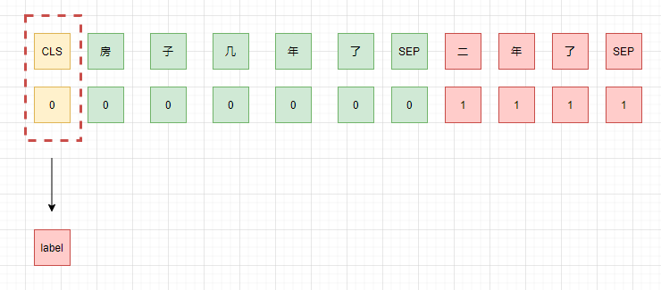
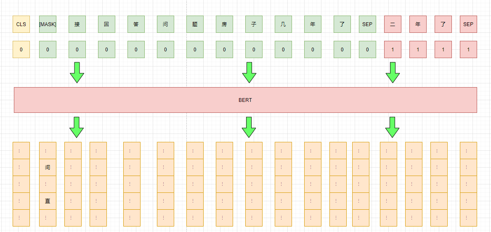
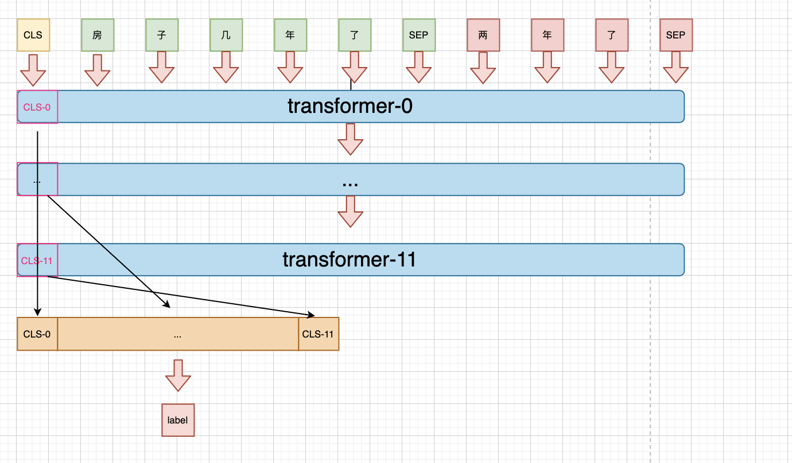

# 比赛
贝壳找房-房产行业聊天问答匹配， 比赛地址[https://www.datafountain.cn/competitions/474/datasets](https://www.datafountain.cn/competitions/474/datasets)

总结博客：[ccf问答匹配](https://xv44586.github.io/2020/11/08/ccf-qa/)

# 简单说明
样本为一个问题多个回答，其中回答有的是针对问题的回答（1），也有不是的（0），其中回答是按顺序排列的。即：
query1: [(answer1, 0), (answer2, 1),...]
任务是对每个回答进行分类，判断是不是针对问题的回答。

# pretrain model weights
预训练模型使用的是哈工大开源的[**`BERT-wwm-ext, Chinese`**](https://github.com/ymcui/Chinese-BERT-wwm)

# Baseline
## 思路一：
不考虑回答之间的顺序关系，将其拆为query-answer 对，然后进行判断。
比如现在的样本是: {query: "房子几年了", answers: [("二年了", 1), ("楼层靠中间"， 0)]},此时我们将其拆分为单个query-answer pair，即：
[{query: "房子几年了", answer: "二年了", label: 1}, {query: "房子几年了", answer: "楼层靠中间", label: 0}]




单模型提交f1: 0.752


## 思路二：
Pattern-Exploiting Training(PET)，即增加一个pattern，将任务转换为MLM任务，然后通过pattern的得分来判断对应的类别。
如本次样本可以添加一个前缀pattern："简接回答问题"/"直接回答问题"，分别对应label 0/1,pattern的得分只需看第一个位置中"间"/"直" 两个token的概率谁高即可。
此外，训练时还可以借助bert的预训练任务中的mlm任务增强模型的泛化能力。更详细的请介绍请查阅[文本分类秒解](https://xv44586.github.io/2020/10/25/pet/)

对于本次样本，对应的示意图如下：




单模型提交f1: 0.76+

## 思路三：
由于bert 不同的transformer 层提取到的语义粒度不同，而不同粒度的信息对分类来说起到的作用也不同，所以可以concat所以粒度的语义信息，拼接后作为特征进行分类。

对应于本次样本，示意图如下：



单模型提交f1: 0.75+

# 优化思路

## Post training

### mlm

提升mlm任务中的mask策略，提升难度，提高下游性能：挖掘新词，加入词典，whole word mask + dynamic mask

* 挖掘新词

```bash
python new_words_mining.py 
```

## 对抗训练

使用FGM方法对EMbedding进行扰动：

```bash
python pair-adversarial-train.py
```

## 数据增强

数据增强主要尝试了两种方式：EDA与伪标签。

* EDA
  随机删除/随机替换/随机插入/随机重复，操作比例10%，每个样本生成4个新样本
  词向量质量低，所以使用从当前句子随机选取一个词作为同义词进行操作

* 伪标签
  用已训练的模型对test data打上标签加入训练集


